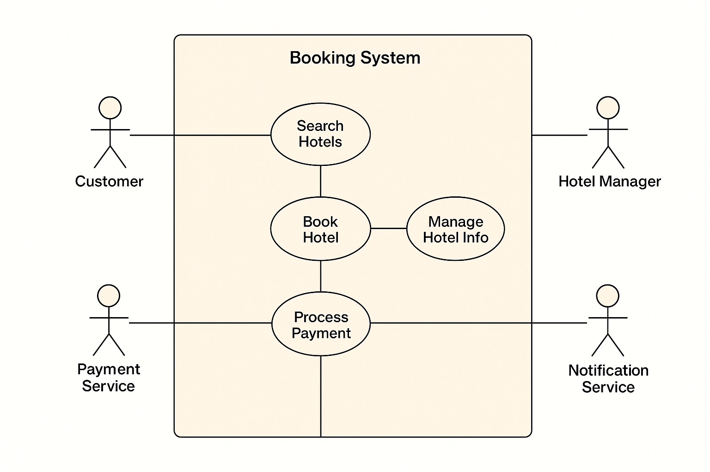

# Requirement Analysis in Software Development

This repository is dedicated to documenting the principles, practices, and application of requirement analysis in the Software Development Lifecycle (SDLC).

It serves as a structured learning project where key concepts such as requirement gathering, functional vs. non-functional requirements, use case diagrams, and acceptance criteria are explored and documented.

The goal of this repository is to provide clarity, precision, and professional documentation standards that emulate real-world software development scenarios.

## What is Requirement Analysis?

Requirement Analysis is a critical phase in the Software Development Lifecycle (SDLC) where the needs, expectations, and constraints of stakeholders are gathered, analyzed, and documented. It focuses on answering the question: _“What should the system do, and under what conditions should it operate?”_

This process involves identifying **functional requirements** (what the system should do, such as features and behaviors) and **non-functional requirements** (how the system should perform, such as security, performance, and scalability).

### Importance in the SDLC

1. **Foundation for Development** – Clear requirements serve as the blueprint for designers, developers, and testers, ensuring that everyone works toward the same goal.
2. **Minimizes Errors and Rework** – Well-documented requirements reduce misunderstandings, preventing costly changes later in the development cycle.
3. **Alignment with Business Goals** – Ensures the system meets both user needs and organizational objectives.
4. **Facilitates Communication** – Acts as a common language between stakeholders, developers, and project managers.
5. **Scope Management** – Helps define project boundaries and prevents scope creep by clarifying what is and isn’t included.

In essence, Requirement Analysis bridges the gap between the **problem domain** (what stakeholders need) and the **solution domain** (what developers build), making it a cornerstone for successful software projects.

## Why is Requirement Analysis Important?

Requirement Analysis is one of the most crucial steps in the Software Development Lifecycle (SDLC) because it lays the groundwork for building successful software. Without it, projects risk delays, misunderstandings, or failure to meet user expectations. Below are key reasons why Requirement Analysis is critical:

1. **Prevents Miscommunication**  
   Requirement Analysis ensures that developers, testers, and stakeholders share a common understanding of the system’s goals. This reduces ambiguity and avoids costly mistakes caused by unclear expectations.

2. **Saves Time and Cost**  
   Identifying requirements early helps detect potential issues before development begins. This minimizes rework, reduces project risks, and saves resources in the long run.

3. **Defines Clear Scope**  
   It establishes what is included (and excluded) in the project. This prevents _scope creep_ and keeps the project focused, ensuring timely and successful delivery.

4. **Aligns with Business Objectives**  
   Requirement Analysis ensures that the system being developed directly supports the organization’s goals and adds real value to end-users.

5. **Improves Quality of the Final Product**  
   By specifying both functional and non-functional requirements, Requirement Analysis ensures the software is not only feature-rich but also reliable, secure, and user-friendly.

## Key Activities in Requirement Analysis

Requirement Analysis involves a series of activities that ensure software requirements are well understood, documented, and validated. The five key activities are:

- **Requirement Gathering**  
  Collecting initial information about the system from stakeholders through interviews, surveys, observations, and existing documentation. This step focuses on understanding what users need.

- **Requirement Elicitation**  
  Engaging with stakeholders to refine and clarify requirements using techniques like brainstorming, workshops, prototyping, and questionnaires. The goal is to uncover both explicit and implicit needs.

- **Requirement Documentation**  
  Recording requirements in a clear and structured manner using tools such as Software Requirement Specification (SRS) documents, user stories, and use case diagrams. This serves as a reference for the development team.

- **Requirement Analysis and Modeling**  
  Analyzing gathered requirements to identify conflicts, redundancies, and feasibility. Visual models such as data flow diagrams (DFD), entity-relationship diagrams (ERD), and use case diagrams are created to illustrate system behavior.

- **Requirement Validation**  
  Reviewing and confirming requirements with stakeholders to ensure they are complete, consistent, and aligned with business goals. This helps detect gaps and ensures that the documented requirements meet user expectations.

## Types of Requirements

In software engineering, requirements are broadly classified into **Functional Requirements** and **Non-functional Requirements**. Both are essential to ensure the system works correctly and provides a smooth user experience.

### Functional Requirements

Functional requirements define **what the system should do**. They specify the features, services, and tasks the system must perform.

**Examples for Hotel Booking Management Project:**

- Users should be able to **search for hotels** based on location, availability, and price.
- Customers can **make a booking** and receive a confirmation notification.
- Hotel managers can **add, update, or delete hotel details** such as room types, prices, and availability.
- The system should **integrate with a payment gateway** (e.g., Stripe, PayPal) to handle transactions securely.
- Customers and managers should be able to **view past and upcoming bookings**.

---

### Non-functional Requirements

Non-functional requirements define **how the system should perform** rather than the specific features. They include quality attributes like performance, scalability, usability, and security.

**Examples for Hotel Booking Management Project:**

- **Performance:** The system should handle at least **10,000 concurrent users** without performance degradation.
- **Scalability:** The architecture must support horizontal scaling using microservices and load balancers.
- **Reliability:** The system should provide **99.9% uptime** with failover and disaster recovery mechanisms.
- **Usability:** The booking portal should be intuitive, with **mobile-friendly UI** for both customers and hotel managers.
- **Security:** All sensitive data (e.g., passwords, payment info) must be encrypted, and users must authenticate via **secure login methods (OAuth, 2FA)**.
- **Latency:** Search results should be returned within **2 seconds** using caching (Redis) and indexing (Elasticsearch).

---

## Use Case Diagrams

Use Case Diagrams visually represent the interactions between **actors** (users or external systems) and the **system**. They help identify functional requirements by illustrating what actions each actor can perform and how the system responds.

### Benefits of Use Case Diagrams

- Clarify system boundaries and user interactions.
- Provide a simple, high-level view of system functionality.
- Improve communication between stakeholders and developers.
- Serve as a foundation for creating detailed requirements and test cases.

### Use Case Diagram for Booking System

The following diagram shows the actors and their interactions with the hotel booking system:

### Explanation of the Actors and Use Cases

- **Customer**

  - _Search Hotels_: Browse available hotels using filters.
  - _View Hotel Details_: Access hotel descriptions, pricing, and amenities.
  - _Make Booking_: Reserve a hotel room through the booking service.
  - _View Bookings_: See current and past reservations.
  - _Receive Notifications_: Get booking confirmations, offers, and updates.

- **Hotel Manager**

  - _Manage Hotel Listings_: Add, update, or remove hotel information.
  - _View Bookings_: Track customer reservations for hotel management.
  - _Receive Notifications_: Alerts for new bookings or updates.

- **Payment Service (External Actor)**

  - _Process Payment_: Handles transactions securely on behalf of the booking system.

- **Notification System (External Actor)**
  - _Send Notifications_: Delivers confirmations and alerts to both customers and hotel managers.

This diagram reflects the **three core services** outlined in the architecture:

1. **Hotel Management Service** – used by hotel managers.
2. **Customer Service (Search + Booking)** – used by customers for browsing and booking.
3. **View Booking Service** – used by both customers and managers to track reservations.

## Acceptance Criteria

Acceptance Criteria are the specific conditions that a software feature must meet to be considered complete and acceptable by stakeholders. They help ensure that requirements are clearly understood, testable, and aligned with the user’s needs.

### Importance of Acceptance Criteria

- **Clarity**: Removes ambiguity by defining what “done” means for a feature.
- **Alignment**: Ensures developers, testers, and stakeholders have a shared understanding of requirements.
- **Testability**: Provides measurable conditions that can be validated during testing.
- **Scope Control**: Prevents scope creep by setting clear boundaries for a feature.

### Example: Checkout Feature in Booking Management System

**User Story:**  
_As a customer, I want to securely complete my hotel booking and payment online so that my reservation is confirmed immediately._

**Acceptance Criteria:**

1. The system must allow the customer to review booking details (hotel name, dates, room type, price) before proceeding to checkout.
2. The system must support multiple payment methods (e.g., credit/debit card, mobile money, PayPal).
3. The system must validate payment information and display an error message for invalid details.
4. The system must securely process the payment through the external payment service.
5. Upon successful payment, the system must generate a booking confirmation and send a notification (email/SMS/app).
6. The booking must be recorded in the booking database and visible under “My Bookings” for the customer.
7. If payment fails, the system must display a failure message and allow the user to retry.

This ensures the **Checkout feature** is complete, user-friendly, secure, and testable.
